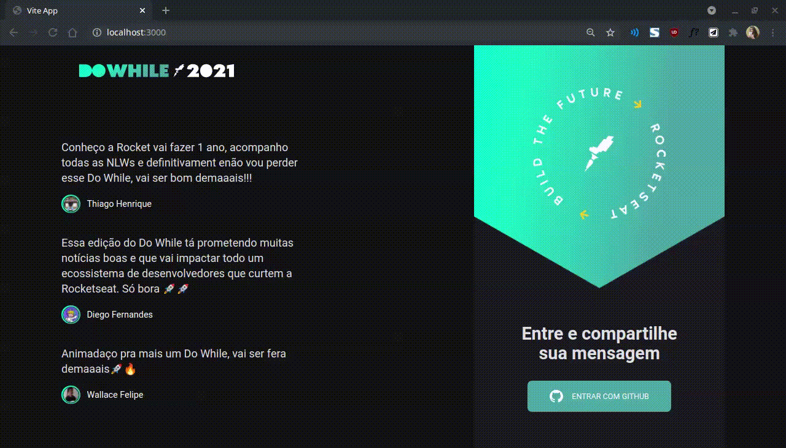

<p align="center">
  
</p>

<p align="center">
  <a href="#projeto">Sobre a aplicação</a>&nbsp;&nbsp;&nbsp;|&nbsp;&nbsp;&nbsp;
  <a href="#demo">Demonstração</a>&nbsp;&nbsp;&nbsp;|&nbsp;&nbsp;&nbsp;
  <a href="#requisitos">Como rodar</a>&nbsp;&nbsp;&nbsp;|&nbsp;&nbsp;&nbsp;
  <a href="#licenca">Licença</a>
</p>

<span id="projeto">
  
## :bookmark_tabs: Sobre a aplicação
O aplicativo "DoWhileApp" tem como objetivo proporcionar um ambiente onde os participantes do Do While 2021 possam comentar suas 
expectativas sobre o evento que acontecerá em dezembro, observando, em tempo real, as mensagens enviadas por outros participantes também.
- Aplicação construída na aula 02 (de React) durante a Next Level Week #07: Heat (evento oferecido pela Rocketseat) 🚀

### :hammer_and_wrench: Tecnologias
As seguintes tecnologias e ferramentas estão sendo utilizadas neste projeto:

- [Figma](http://www.figma.com/)
- [React](https://pt-br.reactjs.org/)
- [TypeScript](https://www.typescriptlang.org/)
- [Socket.io](https://expo.io/)
- [Axios](https://www.typescriptlang.org/)

<span id="demo">
  
## :iphone: Demonstração
Abaixo é possível encontrar uma demonstração das telas e funcionalidades do projeto desenvolvido, com a alteração de cores e algumas imagens, mas se quiser 
conferir o layout original das telas, é só acessar [este link](https://www.figma.com/community/file/1031699316177416916) para o projeto no Figma.
  
<p align="center">
  
</p>

<span id="requisitos">

## :gear: Como rodar
Com o [Node](https://nodejs.org/en/) instalado em sua máquina e o clone da aula 01 de Node (acessível por [este link](https://github.com/MariaGabrielaReis/nlw-07-heat-node)),
baixe ou clone este repositório e siga o passo a passo descrito abaixo:
- Cadastre o aplicativo no GitHub (em configurações < ferramentas de desenvolvedor < OAuth Apps),para conseguir acesso ao serviço de autenticação, 
colocando a homepage url como `http://localhost:4000` e o redirect como `http://localhost:3000`, não esquecendo de gerar uma chave secreta, definindo 
essas configurações também em um arquivo `.env` no projeto Node (siguindo o exemplo abaixo):
 
```cl
GITHUB_CLIENT_SECRET=
GITHUB_CLIENT_ID=
JWT_SECRET=
```
Agora, por um terminal...
```bash
# Acesse a pasta do projeto em Node, instale as dependências, rode as migrations e rode o projeto
$ cd nlw-07-heat-node
$ yarn
$ yarn prisma migrate dev
$ yarn dev

# Acesse a pasta do projeto React, instale as dependências e rode o projeto
$ cd nlw-07-heat-react
$ yarn
$ yarn dev
```
Agora a aplicação está pronta para ser utilizada através da porta 3000, pelo link: [`http://localhost:3000`](http://localhost:3000).

<span id="licenca">

## :page_with_curl: Licença
Esse projeto está sob a licença MIT. Veja o arquivo [LICENSE](LICENSE) para mais detalhes.

[](https://www.linkedin.com/in/mariagabrielareis/)
